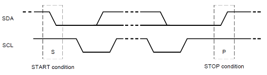

# Name
[Readme](../README.md)
## Information

Name = Serial Digital Interface at 1200 baud
- 

## Types


## Commands
- 

| What | Command | Extra info |
| ---- | :-----: | ---------- |
|      |         |            |

### Examples
```
{
  "firstName": "John",
  "lastName": "Smith",
  "age": 25
}
``` 