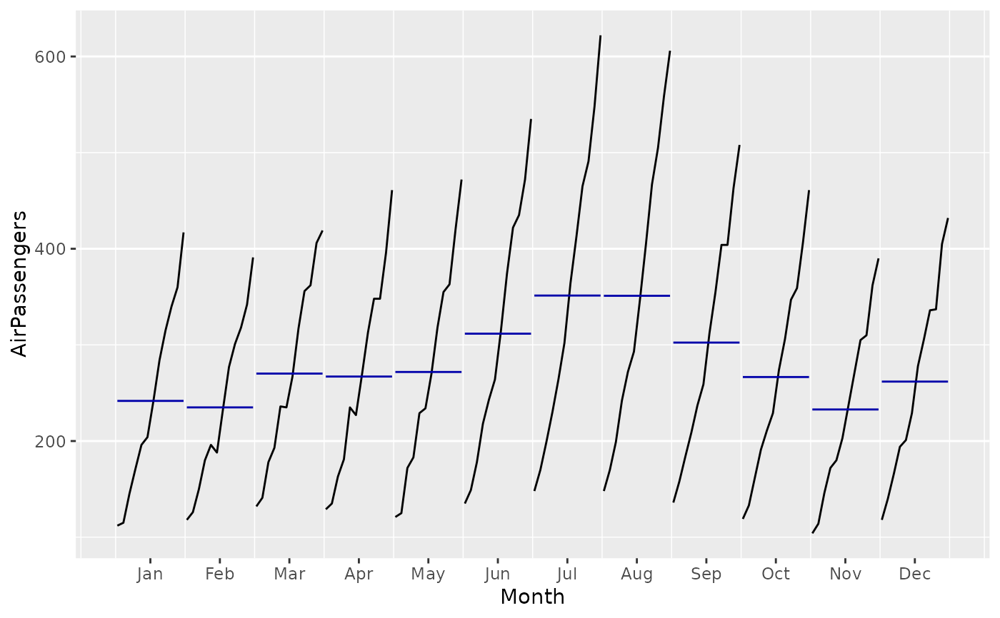
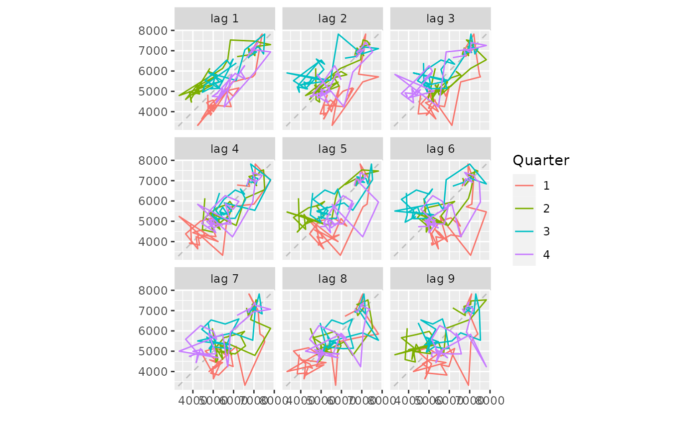
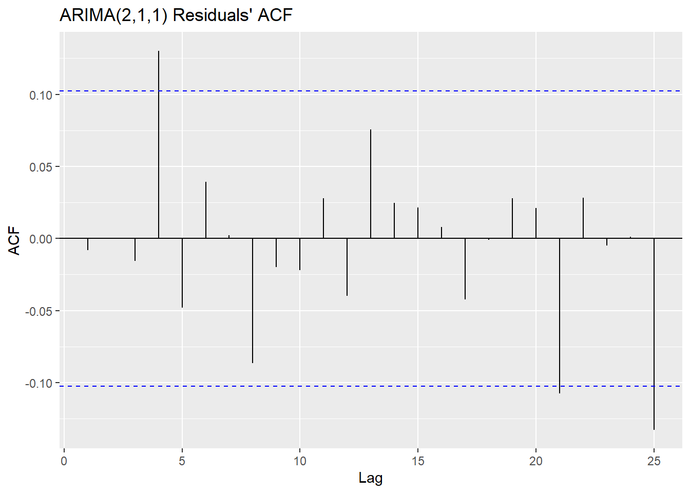
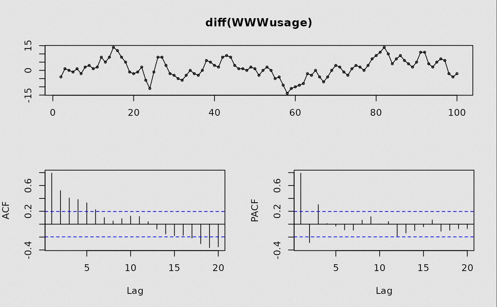
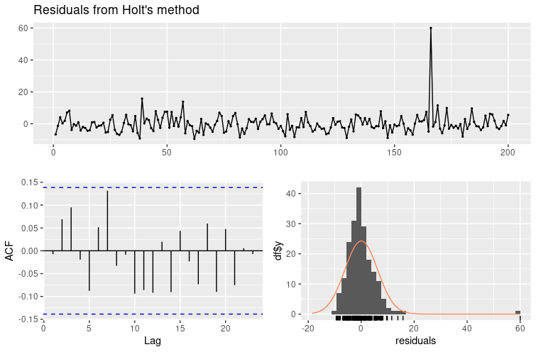
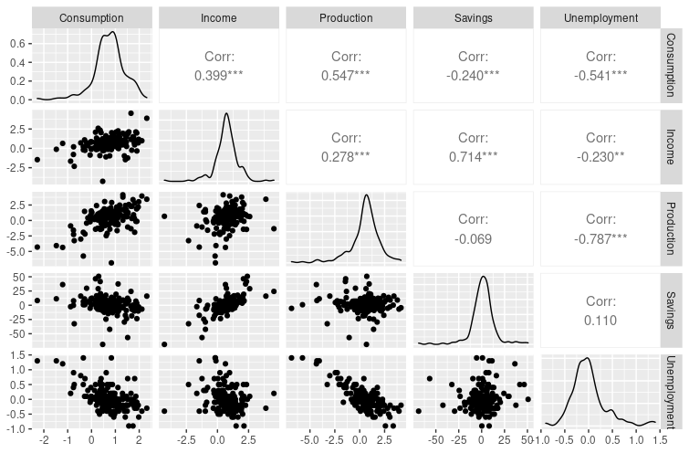

# R
[Readme](../README.md)

- [R](#r)
  - [Information](#information)
  - [Types](#types)
  - [Commands](#commands)
    - [Console](#console)
    - [Piping](#piping)
    - [Default](#default)
    - [Funtions](#funtions)
    - [Prediction models](#prediction-models)
      - [Models](#models)
      - [Model properties](#model-properties)
      - [Decomposition](#decomposition)
      - [Model plotting](#model-plotting)
      - [Transformations](#transformations)
  - [Knit](#knit)
## Information

- use R studio

## Types


## Commands

### Console

| What                | Code                           |
| ------------------- | :----------------------------- |
| Run program         | ```source("file_name.R")  ```  |
| get work dir        | ```source("file_name.R")  ```  |
| set work dir        | ```setwd("/abs/path")  ```     |
| get help            | ```?topic <br> help(topic)```  |
| quit console        | ```q()```                      |
| install packages    | ```install.packages("fpp2")``` |
| clear all variables | ```rm(list=ls())```            |

### Piping
| What             | Code                                          |
| ---------------- | :-------------------------------------------- |
| data to function | ```data %>% function ```                      |
| data to function | ```function(data) ```                         |
| data to var      | ```data -> var ```   <br > ```var <- data ``` |

### Default 

| What                       | Code                                                                          |
| -------------------------- | :---------------------------------------------------------------------------- |
| Save var                   | ```varName <- data```                                                         |
| Autoplot                   | ```autoplot(data)```                                                          |
| Autoplot time series       | ```autoplot(ts(data = goog200,  start=c(2013, 2, 25), frequency = 365.25))``` |
| Print head of object       | ```head(object)```                                                            |
| Row of a dataframe         | ```obj[, "row Name"]```                                                       |
| Col of a dataframe         | ```obj["col Name", ]```                                                       |
| Get/set names of an object | ```obj %>% names``` /     ```names(obj) <- to_set_names```                    |

### Funtions

| What                                                         | Code                  |
| ------------------------------------------------------------ | :-------------------- |
| Plot years as legend                                         | ```ggseasonplot```    |
| Plot years between months                                    | ```ggsubseriesplot``` |
| Plots series agains lagged versions of themself              | ```gglagplot```       |
| This is the diff between x<sub>n</sub> and x<sub>(n-1)</sub> | ```diff```            |
| This is the diff between x<sub>n</sub> and x<sub>(n-1)</sub> | ```ggtsdisplay```     |

> ggsubseriesplot
> 
> 


> gglagplot
> 
> 


### Prediction models
#### Models

| What                                                 | Code             | Example Code                                                                  |
| ---------------------------------------------------- | ---------------- | ----------------------------------------------------------------------------- |
| use last value as forecast                           | ```naive```      | ```naive(data, h=atlFC)```                                                    |
| fc via decomposition                                 | ```stl / stlf``` | ```stlf(data, s.window="periodic") ```                                        |
| simple exponential smoothing                         | ```ses```        | ```ses(data)```                                                               |
| holt linear --> no seasonality                       | ```holt```       | ```holt(data, damped = TRUE)```                                               |
| holt (winters) --> seasonality                       | ```hw```         | ```hw(data,seasonal="multiplicative") ```                                     |
| ETS models --> holt but automatically chosen         | ```ets```        | ```ets(h02, model="AAA", damped=FALSE)```                                     |
| manual arima(pdq)(PDQ)[m]                            | ```Arima```      | ```Arima(data, order=c(0,1,3), seasonal=c(0,1,1)) ```                         |
| automatic arima                                      | ```auto.arima``` | ```auto.arima(data, stepwise=FALSE, approximation=FALSE)```                   |
| linear regression (trend, season, fourier)           | ```tslm```       | ```tslm(data ~ trend + season)```                                             |
| regression (splines ns)                              | ```lm```         | ```lm(eurusd ~ ., data=regdata)```                                            |
| splines forecast                                     | ```splinef```    | ```splinef(data,h=12)```                                                      |
| TBATS: Trigonometric, Box-Cox, ARMA, Trend, Seasonal | ```tbats```      | ```tbats(data)```                                                             |
| Neural Network                                       | ```nnetar```     | ```nnetar(data)```                                                            |
| ARIMAX                                               | ```auto.arima``` | ```auto.arima(train[,1], xreg=train[,-1]) & forecast(fit, xreg=test[,-1]) ``` |


#### Model properties

| What      | Code                  |
| --------- | --------------------- |
| Summary   | summary(model)        |
| Accuracy  | accuracy(fc, test)    |
| Forecasts | forecasts(fit, h=12)  |
| Get fitted values | fitted(model)  |
| Get residuals | residuals(model)  |


#### Decomposition

| What                                         | Code             | Example Code                                  |
| -------------------------------------------- | ---------------- | --------------------------------------------- |
| Seasonal and Trend decomposition using Loess | ```stl```        | ```stl(data, s.window=x, t.window=x)```       |
| X11                                          | ```seas```       | ```library(seasonal) & seas(data, x11="") ``` |
| SEATS                                        | ```seasonal```   | ```library(seasonal) & seas(data)```          |
| Seasonal adjustment                          | ```seasadj```    | ```seasadj(stl(data,s.window="periodic")) ``` |
| Geeft lineaire lijn met trend weer           | ```trendcycle``` | ```trendcycle(getrained model)```             |


#### Model plotting

| What           | Code                        | Extra information |
| -------------- | :-------------------------- | -------- |
| Plots residues | ```ggACF```                 |          |
| Plots residues | ```ggtsdisplay```           |          |
| Plots residues | ```checkresiduals(model)``` |          |
| Plots correlations | ```data %>% as.data.frame %>% GGally::ggpairs()``` |   ```install.packages("GGally")```       |

> ggACF
> 
> 


> ggtsdisplay
> 
> 

> checkresiduals
> 
> 
> 
>
> 1. uncorrelated  (acf plot nothing outside of the blue dotted line) 
> 2. normal distribution (historgram)
> 3. Avergage of 0 (x-axis historgram)
> 4. Constant variance so no ocilations left (residuals)
> 5. p-value needs to be bigger then 0.5 (for no white noise left)

> correlations
> 
> ```uschange %>% as.data.frame %>% GGally::ggpairs()```
>
> 


#### Transformations

| What                              | Code          | Example Code                                                                                                          |
| --------------------------------- | ------------- | --------------------------------------------------------------------------------------------------------------------- |
| Removes outliers                  | ```tsclean``` | ```tsclean(data)```                                                                                                   |
| Split data in window (start, end) | ```window```  | Spliting in Train Test: ```train <- window(sheep, end=c(1925,1))``` <br> ```test <- window(sheep, start=c(1926,1))``` |
| Time series (x,start, frequency)  | ```ts```      |                                                                                                                       |
| Boxcox transformation             | ```BoxCox```  |                                                                                                                       |

BoxCox transformation examples

| What        | Code                           |
| ----------- | :------------------------------ |
| Square root | ```BoxCox(data, lambda=1/2)``` |
| Natural log | ```BoxCox(data, lambda=0)```   |
| Inverse     | ```BoxCox(data, lambda=-1)```  |
| Normal      | ```BoxCox(data, lambda=1)```   |

## Knit
Used to make pdf in R studio. Only from an R markdown file
