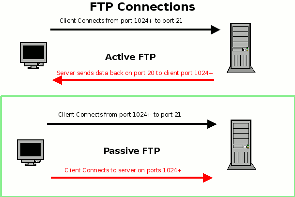

# Protocol FTP
[Readme](../README.md)
## Information

> SMB = File Transfer Protocol

- Network protocol 
  - TCP/IP
- Active/passive
  - Active FTP connection, the client opens a port and listens. The server is required to actively connect to it
  - Passive FTP connection, the server opens a port and listens (passively) and the client connects to it
- A client-server protocol 
- Sharing access to files, printers, serial ports and other resources

## Working



## Commands
### Default commands

| What                 | Command            |
| -------------------- | :----------------- |
| List files           | ```list```         |
| change dir           | ```CWD dir```      |
| change to parent dir | ```CDUP```         |
| Create dir           | ```MKD dir```      |
| Remove dir           | ```RMD dir```      |
| Rename file          | ```RNTO old new``` |
| Delete file          | ```DELE file```    |

### Transfer files

| What                             | Command                           |
| -------------------------------- | :-------------------------------- |
| Upload file/folder               | ```STOR file```                   |
| Append to serverfile file/folder | ```APPE local_file server_file``` |
| Download file/folder             | ```RETR file```                   |

### Other commands

| What                       | Command               |
| -------------------------- | :-------------------- |
| Get info over command      | ```?command```       |
| Run command in local shell | ```!shell-command``` |