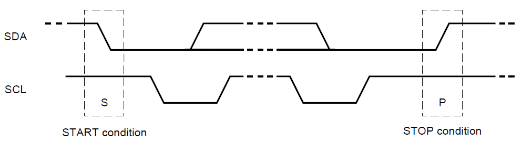

# Protocol I²C
[Readme](../README.md)
## Information

I²C = Inter Integrated Circuit

- Not default baut rate
- 2 data wires
- Made for short distances (less than 1m)
- Packets of 10 bits
- synchronous Transmission
- Master/Slave(s)

## Working
- Wires
  - Use pull-up resistor on the 2 datawires
  
| Short |     Long     | info |
| ----- | :----------: | ---- |
| SCL   | serial clock |      |
| SDA   | serial data  |      |

### Setup
1. Used pins on alternate function
2. Add Clock to I²C-module
3. Set timing (100kHz, rise and fall times, ...)
4. Enable I²C-module