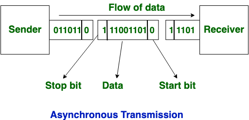

# Protocol_overview

# Protocol overview
[Readme](../README.md)

## Networking Protocols
- [SMB](SMB.md#protocol-smb)
- [Telnet](telnet.md#telnet)
- [NFS](NFS.md#NFS)
## IoT Protocols

- [I²C](I%C2%B2C.md)
- [UART](UART.md#protocol-uart)
- [SDI12](SDI12.md#protocol-sdi12)
- [SPI](SPI.md#protocol-spi)
### Synchronous and Asynchronous 
#### Synchronous Transmission

- continius flow of data
- blocks/frames of data
- no gap between data
- full duplex (dataline for send and another one for recieve)

#### Asynchronous Transmission

- stop and start bit
- half duplex type transmission
