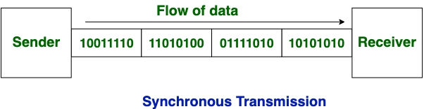

# Protocol overview
[Readme](../README.md)

## Synchronous and Asynchronous 
### Synchronous Transmission

- continius flow of data
- blocks/frames of data
- no gap between data
- full duplex

### Asynchronous Transmission

- stop and start bit
- half duplex type transmission