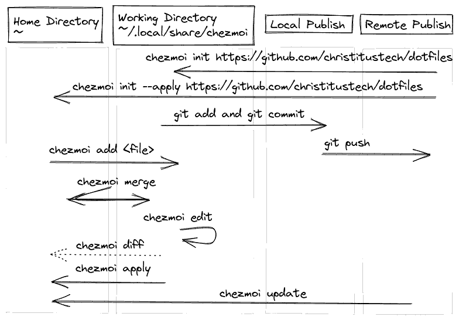

# chezmoi

> chezmoi is 

## tool notes


# Chezmoi
[Readme](../README.md)
## workflow


| What     | Command                                                      |
| -------- | :----------------------------------------------------------- |
| install  | ```sh -c "$(curl -fsLS chezmoi.io/get)"   ```                |
| init     | ```chezmoi init git@github.com:/jarneamerlinck/dotconfig ``` |
| add file | ```chezmoi add file```                                    |
| edit     | ```chezmoi edit file```                                   |
| apply    | ```chezmoi apply```                                       |
| update   | ```chezmoi update```                                      |