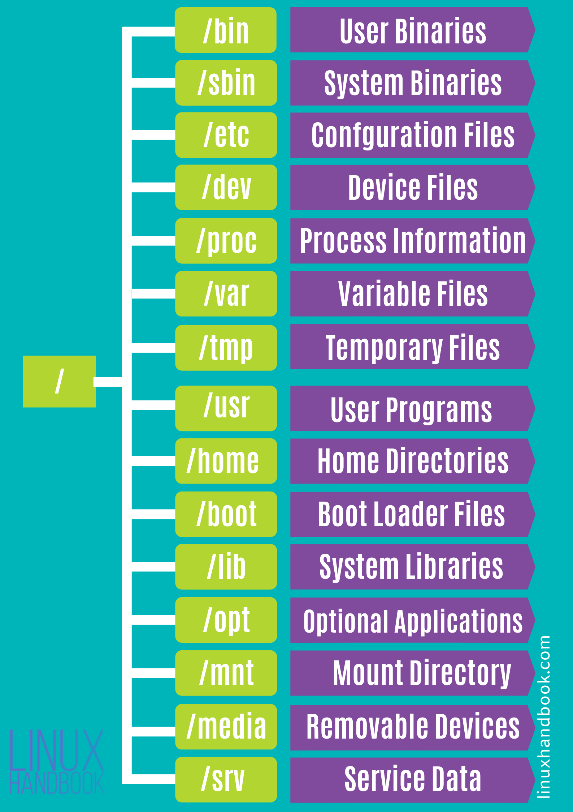

# Linux
[Readme](../README.md)
- [Linux](#linux)
	- [Folder structure](#folder-structure)
		- [/](#)
		- [/bin](#bin)
		- [/dev](#dev)
		- [/etc](#etc)
		- [/usr](#usr)
		- [/home](#home)
		- [/lib](#lib)
		- [/sbin](#sbin)
		- [/tmp](#tmp)
		- [/var](#var)
		- [/boot](#boot)
		- [/proc](#proc)
		- [/opt](#opt)
		- [/root](#root)
		- [/media](#media)
		- [/mnt](#mnt)
		- [/srv](#srv)
	- [Super handy ones](#super-handy-ones)
- [Networking](#networking)
	- [Links](#links)
	- [Ip addresses and more](#ip-addresses-and-more)
	- [Sockets](#sockets)
	- [DNS-server](#dns-server)
	- [DHCP-server](#dhcp-server)
	- [ftp-server](#ftp-server)
	- [ssl certs](#ssl-certs)
	- [SSH settings](#ssh-settings)
	- [Firewall](#firewall)
	- [Serial Ports](#serial-ports)
	- [Notifications from cli](#notifications-from-cli)
	- [Raspberry:](#raspberry)


## Folder structure



### /
Everything, all the files and directories, in Linux are located under ‘root’ represented by ‘/’.
### /bin
The ‘/bin’ directly contains the executable files of many basic shell commands like ls, cp, cd etc. Mostly the programs are in binary format here and accessible by all the users in the Linux system.
### /dev
This directory only contains special files, including those relating to the devices. These are virtual files, not physically on the disk.

Some interesting examples of these files are:

| dev         | Use                                            |
| ----------- | :--------------------------------------------- |
| /dev/null   | can be sent to destroy any file or string      |
| /dev/zero   | contains an infinite sequence of 0             |
| /dev/random | contains an infinite sequence of random values |

### /etc
The /etc directory contains the core configuration files of the system, use primarily by the administrator and services, such as the password file and networking files.

### /usr
In ‘/usr’ go all the executable files, libraries, source of most of the system programs. For this reason, most of the files contained therein is read­only (for the normal user)

| folder     | Use                                                |
| ---------- | :------------------------------------------------- |
| /usr/bin   | contains basic user commands                       |
| /usr/sbin  | contains additional commands for the administrator |
| /usr/lib   | contains the system libraries                      |
| /usr/share | contains documentation or common to all libraries  |

### /home
Home directory contains personal directories for the users. The home directory contains the user data and user-specific configuration files. As a user, you’ll put your personal files, notes, programs etc in your home directory.

### /lib
Libraries are basically codes that can be used by the executable binaries. The /lib directory holds the libraries needed by the binaries in /bin and /sbin directories.
Libraries needed by the binaries in the /usr/bin and /usr/sbin are located in the directory /usr/lib.

### /sbin
This is similar to the /bin directory. The only difference is that is contains the binaries that can only be run by root or a sudo user. You can think of the ‘s’ in ‘sbin’ as super or sudo.

### /tmp
As the name suggests, this directory holds temporary files. Many applications use this directory to store temporary files. Even you can use directory to store temporary files.
But do note that the contains of the /tmp directories are deleted when your system restarts. Some Linux system also delete files old files automatically so don’ store anything important here.

### /var
Var, short for variable, is where programs store runtime information like system logging, user tracking, caches, and other files that system programs create and manage.
The files stored here are NOT cleaned automatically and hence it provides a good place for system administrators to look for information about their system behavior. For example, if you want to check the login history in your Linux system, just check the content of the file in /var/log/wtmp.

### /boot
The ‘/boot’ directory contains the files of the kernel and boot image, in addition to LILO and Grub. It is often advisable that the directory resides in a partition at the beginning of the disc.

### /proc
The ‘/proc’ directory contains the information about currently running processes and kernel parameters. The content of the proc directory is used by a number of tools to get runtime system information.
For example, if you want to check processor information in Linux, you can simply refer to the file /proc/cpuinfo. You want to check memory usage of your Linux system, just look at the content of /proc/meminfo file.

### /opt
Traditionally, the /opt directory is used for installing/storing the files of third-party applications that are not available from the distribution’s repository.
The normal practice is to keep the software code in opt and then link the binary file in the /bin directory so that all the users can run it.

### /root
There is /root directory as well and it works as the home directory of the root user. So instead of /home/root, the home of root is located at /root. Do not confuse it with the root directory (/).

### /media
When you connect a removable media such as USB disk, SD card or DVD, a directory is automatically created under the /media directory for them. You can access the content of the removable media from this directory.

### /mnt
This is similar to the /media directory but instead of automatically mounting the removable media, mnt is used by system administrators to manually mount a filesystem.

### /srv
The /srv directory contains data for services provided by the system. For example, if you run a HTTP server, it’s a good practice to store the website data in the /srv directory.


## Super handy ones
| What                                | Command                                                                                                                                                        |
| ----------------------------------- | :------------------------------------------------------------------------------------------------------------------------------------------------------------- |
| copy any selected text to clipboard | xclip -out -selection primary                                                                                                                                  | xclip -in -selection clipboard``` |
| set hostname                        | ```sudo hostnamectl set-hostname own_hostname --static;head -n -3 /etc/hosts > tmp.txt && mv tmp.txt /etc/hosts;echo '127.0.1.1	own_hostname' >> /etc/hosts``` |

# Networking

## Links

| What              | Command                               |
| ----------------- | :------------------------------------ |
| show network link | ```ip link```                         |
| disable link      | ```sudo ip link set down link_name``` |
| enable link       | ```sudo ip link set up link_name```   |

## Ip addresses and more

| What                        | Command                     |
| --------------------------- | :-------------------------- |
| show ip                     | ```ip address show```       |
| show ip addresses IPv4/IPv6 | ```ip neigh```              |
| trace path to ip/dns name   | ```tracepath destination``` |
| see dns config              | ```resolvectl```            |


## Sockets
ss is an upgrade of netstat

| What                     | Command     |
| ------------------------ | :---------- |
| show ss (socket status)  | ```ss```    |
| show open ports          | ```ss -a``` |
| tcp only                 | ```ss -t``` |
| udp only                 | ```ss -u``` |
| show statistics of ports | ```ss -s``` |
| show lisening only       | ```ss -l``` |
| show prosess             | ```ss -p``` |

## DNS-server

| What                                  | Command                                                       |
| ------------------------------------- | :------------------------------------------------------------ |
| install bind                          | ```sudo apt install -y bind9 bind9utils bind9-doc dnsutils``` |
| files in                              | ```/etc/bind/```                                              |
| check bind version                    | ```named -v```                                                |
| check configs (/etc/bind9/)for errors | ```sudo named-checkconf```                                    |
| check zone for errors                 | ```sudo named-checkzone zone.name /etc/bind/file_name```      |
| check bind version                    | ```named -v```                                                |
| check bind version                    | ```named -v```                                                |

## DHCP-server

| What                | Command                                |
| ------------------- | :------------------------------------- |
| install dhcp server | ```sudo apt install isc-dhcp-server``` |
| files in            | ```/etc/dhcp/dhcpd.conf```             |
| service name        | ```isc-dhcp-server.service```          |

## ftp-server

| What                          | Command                                                                                                                                                 |
| ----------------------------- | :------------------------------------------------------------------------------------------------------------------------------------------------------ |
| install ftp server            | ```sudo apt install vsftpd```                                                                                                                           |
| files in                      | ```/etc/vsftpd.conf```                                                                                                                                  |
| service name                  | ```vsftpd.service```                                                                                                                                    |
| add ssl cert (in config file) | ```ssl_enable=YES```<br>&nbsp;&nbsp;```rsa_cert_file=/etc/ssl/certs/vsftpd.crt```<br>&nbsp;&nbsp;```rsa_private_key_file=/etc/ssl/private/vsftpd.key``` |


												
## ssl certs
- These are used to authenticate an application for https.
- See [certs](../infrastructure/Keys.md#ssl-certs) for the install information


## SSH settings

- File is /etc/ssh/sshd_config.
- see man sshd_config for more info
- allow user without shell add ```/bin/nologin``` to ```/etc/shells```
- See [keys](../infrastructure/Keys.md#ssh-keys) for all key information
## Firewall

| What                   | Command                     |
| ---------------------- | :-------------------------- |
| see status of firewall | ```sudo ufw status```       |
| allow port             | ```sudo ufw allow 22/tcp``` |
| see status of firewall | ```sudo ufw status```       |


## Serial Ports

| What                                  | Command                                |
| ------------------------------------- | :------------------------------------- |
| unlock serial port (reboot is needed) | ```sudo usermod -a -G dialout $USER``` |
| find usb port                         | ```sudo dmesg  \| grep tty```          |
| talk to port                          | ```tio /dev/ttyACM0 -b 9600```         |

## Notifications from cli 


| What            | Command                                                      |
| --------------- | :----------------------------------------------------------- |
| send            | ```ntfy send message```                                      |
| send after task | ```task && ntfy send "sucessfull" \|\| ntfy send "failed"``` |
| app for andoid  | pushbullet                                                   |

## Raspberry:
is arm71 en support armhf
